# ITSM AI## 📋 Table of Contents

1. [🎯 Finalized AI Architecture](#-finalized-ai-architecture)
2. [🏗️ Agent Architecture Design](#️-agent-architecture-design)
3. [🔄 State Management & Communication Protocol](#-state-management--communication-protocol)
4. [🛠️ Configuration & Reusability Framework](#️-configuration--reusability-framework)
5. [🚀 Step-by-Step Implementation Plan](#-step-by-step-implementation-plan)
6. [🎯 Recommended Answers to Your Questions](#-recommended-answers-to-your-questions)
7. [📋 Implementation Checklist](#-implementation-checklist)ture & Agent Communication - Implementation Plan

**Architecture**: LangGraph Sequential with Hierarchical Workflow  
**Communication**: Synchronous State Passing  
**Last Updated**: July 23, 2025  
**Document Version**: 2.0

---

## � Table of Contents

1. [🎯 Finalized AI Architecture](#-finalized-ai-architecture)
2. [🏗️ Agent Architecture Design](#️-agent-architecture-design)
3. [�🔄 State Management & Communication Protocol](#-state-management--communication-protocol)
4. [🛠️ Configuration & Reusability Framework](#️-configuration--reusability-framework)
5. [🚀 Step-by-Step Implementation Plan](#-step-by-step-implementation-plan)
6. [🎯 Recommended Answers to Your Questions](#-recommended-answers-to-your-questions)
7. [📋 Implementation Checklist](#-implementation-checklist)

---

## 🎯 Finalized AI Architecture

### **Selected Architecture: LangGraph Sequential System** ✅

```
Ticket Input
    ↓
Orchestrator Agent (Workflow Manager)
    ↓
Arabic Processing Agent (Language Specialist)
    ↓
Category Classifier Agent (Level 1)
    ↓
Subcategory Classifier Agent (Level 2)
    ↓
Validation Agent (Quality Control)
    ↓
Learning Agent (Continuous Improvement)
    ↓
Final Result
```

### **Design Decisions Made** ✅
- **Communication**: Synchronous state passing between agents
- **Agent Count**: 6 specialized agents with clear responsibilities
- **Arabic Processing**: Separate dedicated agent (recommended for reusability)
- **State Management**: LangGraph MemorySaver with Redis upgrade path

---

## 🏗️ Agent Architecture Design

### **Agent Responsibilities & Communication Flow**

#### **1. Orchestrator Agent** 🎭
**Role**: Workflow management and coordination
**Input**: Raw ticket + company configuration
**Output**: Initialized state with routing decisions
```python
class OrchestratorAgent:
    responsibilities = [
        "Initialize ticket processing state",
        "Load company-specific configurations", 
        "Route tickets based on complexity",
        "Handle overall workflow errors",
        "Coordinate agent sequence execution"
    ]
```

#### **2. Arabic Processing Agent** 🔤
**Role**: Arabic language understanding and normalization
**Input**: Raw Arabic text + metadata
**Output**: Processed and normalized text with entities
```python
class ArabicProcessingAgent:
    responsibilities = [
        "Normalize Arabic text (remove diacritics, standardize)",
        "Extract named entities (technical terms, locations, etc.)",
        "Detect dialect variations and convert to MSA",
        "Identify technical terminology and acronyms",
        "Prepare structured text for classification"
    ]
    
    # Reusability: Can be used by multiple classification agents
    def process_text(self, text: str) -> ProcessedArabicText:
        # Centralized Arabic processing logic
        pass
```

#### **3. Category Classifier Agent** 📊
**Role**: Main category classification (Level 1)
**Input**: Processed Arabic text + few-shot examples
**Output**: Main category + confidence score
```python
class CategoryClassifierAgent:
    responsibilities = [
        "Classify tickets into main categories (70+ categories)",
        "Generate confidence scores for classifications",
        "Provide reasoning for classification decisions",
        "Handle ambiguous cases with multiple possibilities",
        "Maintain few-shot example database"
    ]
```

#### **4. Subcategory Classifier Agent** 🎯
**Role**: Subcategory classification (Level 2)
**Input**: Main category + processed text + context
**Output**: Subcategory + confidence score
```python
class SubcategoryClassifierAgent:
    responsibilities = [
        "Context-aware subcategory classification",
        "Use main category to narrow subcategory options",
        "Handle hierarchical relationships between categories",
        "Provide detailed classification reasoning",
        "Maintain category-specific examples"
    ]
```

#### **5. Validation Agent** ✅
**Role**: Quality control and conflict resolution
**Input**: Classification results + confidence scores
**Output**: Validation status + recommendations
```python
class ValidationAgent:
    responsibilities = [
        "Validate classification consistency",
        "Check confidence score thresholds",
        "Detect potential misclassifications",
        "Generate clarification questions for low confidence",
        "Route to human review when necessary"
    ]
    
    # Conflict Resolution Strategy
    def resolve_conflicts(self, classification_results):
        # Use confidence scores + business rules
        # Escalate ambiguous cases to human review
        pass
```

#### **6. Learning Agent** 🧠
**Role**: Continuous improvement and knowledge management
**Input**: Validated results + human feedback
**Output**: Updated models and knowledge base
```python
class LearningAgent:
    responsibilities = [
        "Collect and analyze classification performance",
        "Update few-shot examples based on validated results",
        "Identify problematic category pairs",
        "Generate synthetic training examples",
        "Monitor and prevent model drift"
    ]
```

---

## � State Management & Communication Protocol

### **Ticket State Schema**
```python
@dataclass
class TicketState:
    # Input Layer
    ticket_id: str
    original_text: str
    company_id: str
    metadata: Dict[str, Any]
    timestamp: datetime
    
    # Arabic Processing Layer
    normalized_text: str = ""
    extracted_entities: List[Entity] = field(default_factory=list)
    technical_terms: List[str] = field(default_factory=list)
    dialect_detected: str = ""
    processing_confidence: float = 0.0
    
    # Classification Layer
    main_category: str = ""
    main_confidence: float = 0.0
    main_reasoning: str = ""
    subcategory: str = ""
    sub_confidence: float = 0.0
    sub_reasoning: str = ""
    
    # Validation Layer
    validation_status: str = ""  # "approved", "needs_review", "rejected"
    validation_reasoning: str = ""
    clarification_questions: List[str] = field(default_factory=list)
    requires_human: bool = False
    
    # Learning Layer
    feedback_collected: bool = False
    human_validated: bool = False
    improvement_suggestions: List[str] = field(default_factory=list)
    
    # Metadata
    processing_time: float = 0.0
    agent_sequence: List[str] = field(default_factory=list)
    error_logs: List[str] = field(default_factory=list)
```

### **Agent Communication Flow**

```mermaid
graph TD
    A[Ticket Input] --> B[Orchestrator]
    B --> C[Arabic Agent]
    C --> D[Category Agent]
    D --> E{Main Confidence ≥ 0.8?}
    E -->|Yes| F[Subcategory Agent]
    E -->|No| G[Validation Agent]
    F --> H{Sub Confidence ≥ 0.7?}
    H -->|Yes| I[Validation Agent]
    H -->|No| G
    G --> J{Validation Passed?}
    J -->|Yes| K[Learning Agent]
    J -->|No| L[Human Review Queue]
    I --> K
    L --> K
    K --> M[Final Result]
    
    style A fill:#e1f5fe
    style M fill:#c8e6c9
    style L fill:#ffcdd2
```


### **Synchronous State Passing Protocol**
```python
class AgentCommunicationProtocol:
    """Handles synchronous state passing between agents"""
    
    async def execute_workflow(self, initial_state: TicketState) -> TicketState:
        current_state = initial_state
        
        # Sequential agent execution with state passing
        agents = [
            self.orchestrator,
            self.arabic_processor, 
            self.category_classifier,
            self.subcategory_classifier,
            self.validator,
            self.learner
        ]
        
        for agent in agents:
            try:
                # Each agent processes and returns updated state
                current_state = await agent.process(current_state)
                current_state.agent_sequence.append(agent.__class__.__name__)
                
                # Check if agent requests workflow termination
                if current_state.requires_human:
                    current_state = await self.handle_human_escalation(current_state)
                    break
                    
            except AgentException as e:
                current_state = await self.handle_agent_error(current_state, agent, e)
                
        return current_state
```

---

## 🛠️ Configuration & Reusability Framework

### **Agent Configuration Architecture**

#### **1. Base Agent Configuration**
```python
@dataclass
class BaseAgentConfig:
    agent_name: str
    model_name: str = "gpt-4"
    temperature: float = 0.1
    max_tokens: int = 1000
    timeout_seconds: int = 30
    retry_attempts: int = 3
    confidence_threshold: float = 0.7
    
class ConfigurableAgent:
    def __init__(self, config: BaseAgentConfig):
        self.config = config
        self.llm = self._initialize_model()
    
    def _initialize_model(self):
        return ChatOpenAI(
            model=self.config.model_name,
            temperature=self.config.temperature,
            max_tokens=self.config.max_tokens
        )
```

#### **2. Company-Specific Configuration**
```python
@dataclass 
class CompanyConfig:
    company_id: str
    company_name: str
    
    # Arabic Processing Config
    arabic_dialect: str = "MSA"  # MSA, Gulf, Levantine, Egyptian
    technical_glossary: Dict[str, str] = field(default_factory=dict)
    
    # Classification Config
    category_hierarchy: Dict[str, List[str]] = field(default_factory=dict)
    custom_categories: List[str] = field(default_factory=list)
    confidence_thresholds: Dict[str, float] = field(default_factory=lambda: {
        "main_category": 0.8,
        "subcategory": 0.7,
        "human_escalation": 0.5
    })
    
    # Business Rules
    priority_keywords: List[str] = field(default_factory=list)
    escalation_rules: Dict[str, Any] = field(default_factory=dict)
    
class CompanyConfigManager:
    def __init__(self):
        self.configs = {}
    
    def load_company_config(self, company_id: str) -> CompanyConfig:
        # Load from database or config files
        return self.configs.get(company_id, self._get_default_config())
    
    def update_company_config(self, company_id: str, config: CompanyConfig):
        # Hot-reload capability for config updates
        self.configs[company_id] = config
```

#### **3. Agent Reusability Pattern**
```python
class ReusableAgentFactory:
    """Factory for creating configured agents for different companies"""
    
    def create_arabic_agent(self, company_config: CompanyConfig) -> ArabicProcessingAgent:
        agent_config = BaseAgentConfig(
            agent_name="arabic_processor",
            model_name="gpt-4",  # Could be company-specific
            temperature=0.0,  # Low temperature for consistent processing
        )
        
        return ArabicProcessingAgent(
            config=agent_config,
            dialect=company_config.arabic_dialect,
            technical_glossary=company_config.technical_glossary
        )
    
    def create_category_agent(self, company_config: CompanyConfig) -> CategoryClassifierAgent:
        agent_config = BaseAgentConfig(
            agent_name="category_classifier",
            confidence_threshold=company_config.confidence_thresholds["main_category"]
        )
        
        return CategoryClassifierAgent(
            config=agent_config,
            categories=company_config.category_hierarchy,
            few_shot_examples=self._load_company_examples(company_config.company_id)
        )
```

### **4. Multi-Tenant Agent Management**
```python
class MultiTenantAgentManager:
    """Manages agent instances across multiple companies"""
    
    def __init__(self):
        self.agent_pools = {}  # company_id -> agent_instances
        self.config_manager = CompanyConfigManager()
        self.factory = ReusableAgentFactory()
    
    async def get_workflow_for_company(self, company_id: str) -> TicketClassificationWorkflow:
        if company_id not in self.agent_pools:
            await self._initialize_company_agents(company_id)
        
        return self.agent_pools[company_id]["workflow"]
    
    async def _initialize_company_agents(self, company_id: str):
        config = self.config_manager.load_company_config(company_id)
        
        # Create company-specific agent instances
        agents = {
            "orchestrator": self.factory.create_orchestrator_agent(config),
            "arabic": self.factory.create_arabic_agent(config),
            "category": self.factory.create_category_agent(config),
            "subcategory": self.factory.create_subcategory_agent(config),
            "validator": self.factory.create_validation_agent(config),
            "learner": self.factory.create_learning_agent(config)
        }
        
        # Create workflow with configured agents
        workflow = TicketClassificationWorkflow(agents=agents, config=config)
        
        self.agent_pools[company_id] = {
            "agents": agents,
            "workflow": workflow,
            "config": config
        }
```

---

## 🚀 Step-by-Step Implementation Plan

### **Phase 1: Core Agent Framework (Week 1-2)**

#### **Step 1: Base Agent Infrastructure**
```python
# Week 1: Day 1-3
class BaseAgent(ABC):
    def __init__(self, config: BaseAgentConfig):
        self.config = config
        self.llm = self._initialize_model()
        self.metrics = AgentMetrics()
    
    @abstractmethod
    async def process(self, state: TicketState) -> TicketState:
        """Process ticket state and return updated state"""
        pass
    
    def _log_processing(self, state: TicketState, result: Any):
        """Centralized logging for all agents"""
        pass
    
    def _update_metrics(self, processing_time: float, success: bool):
        """Track agent performance metrics"""
        pass

# Implementation Priority:
# 1. BaseAgent abstract class ✓
# 2. Agent configuration system ✓  
# 3. Error handling framework ✓
# 4. Metrics collection ✓
```

#### **Step 2: State Management System**
```python
# Week 1: Day 4-5
class TicketStateManager:
    def __init__(self):
        self.memory_saver = MemorySaver()  # Start simple
        self.state_validators = []
    
    def save_state(self, ticket_id: str, state: TicketState):
        """Persist state at each agent step"""
        pass
    
    def load_state(self, ticket_id: str) -> TicketState:
        """Retrieve state for continuation"""
        pass
    
    def validate_state_transition(self, old_state: TicketState, new_state: TicketState) -> bool:
        """Ensure valid state transitions between agents"""
        pass

# Implementation Priority:
# 1. MemorySaver integration ✓
# 2. State validation rules ✓
# 3. State persistence interface ✓
# 4. Recovery mechanisms (Future: Week 3)
```

#### **Step 3: Company Configuration Framework**
```python
# Week 2: Day 1-2
class ConfigurationManager:
    def __init__(self):
        self.company_configs = {}
        self.default_config = self._load_default_config()
    
    def get_company_workflow(self, company_id: str) -> WorkflowConfig:
        """Return configured workflow for specific company"""
        pass
    
    def hot_reload_config(self, company_id: str, new_config: CompanyConfig):
        """Update configuration without restart"""
        pass

# Implementation Priority:
# 1. Configuration schema definition ✓
# 2. Default configuration setup ✓
# 3. Company-specific overrides ✓
# 4. Hot-reload mechanism ✓
```

### **Phase 2: Specialized Agent Implementation (Week 3-4)**

#### **Step 4: Arabic Processing Agent**
```python
# Week 2: Day 3-5
class ArabicProcessingAgent(BaseAgent):
    def __init__(self, config: BaseAgentConfig, dialect: str, technical_glossary: Dict):
        super().__init__(config)
        self.normalizer = ArabicNormalizer()
        self.entity_extractor = ArabicNER(model="CAMeL-Lab/bert-base-arabic-camelbert-mix")
        self.dialect = dialect
        self.technical_glossary = technical_glossary
    
    async def process(self, state: TicketState) -> TicketState:
        # 1. Text normalization
        state.normalized_text = await self._normalize_arabic_text(state.original_text)
        
        # 2. Entity extraction
        state.extracted_entities = await self._extract_entities(state.normalized_text)
        
        # 3. Technical term identification
        state.technical_terms = await self._identify_technical_terms(state.normalized_text)
        
        # 4. Dialect detection and conversion
        state.dialect_detected = await self._detect_dialect(state.normalized_text)
        
        return state

# Implementation Priority:
# 1. Arabic text normalization ✓
# 2. Entity extraction pipeline ✓
# 3. Technical term detection ✓
# 4. Dialect handling ✓
```

#### **Step 5: Classification Agents**
```python
# Week 3: Day 1-3
class CategoryClassifierAgent(BaseAgent):
    def __init__(self, config: BaseAgentConfig, categories: Dict, examples: Dict):
        super().__init__(config)
        self.categories = categories
        self.few_shot_examples = examples
        self.vector_store = QdrantClient()
    
    async def process(self, state: TicketState) -> TicketState:
        # 1. Retrieve relevant examples
        relevant_examples = await self._get_similar_examples(state.normalized_text)
        
        # 2. Build few-shot prompt
        prompt = await self._build_classification_prompt(state, relevant_examples)
        
        # 3. Get LLM classification
        result = await self.llm.ainvoke(prompt)
        
        # 4. Parse and validate result
        state.main_category, state.main_confidence = self._parse_classification(result)
        state.main_reasoning = result.reasoning
        
        return state

class SubcategoryClassifierAgent(BaseAgent):
    """Context-aware subcategory classification based on main category"""
    
    async def process(self, state: TicketState) -> TicketState:
        # Use main category to narrow subcategory options
        subcategory_options = self.get_subcategories_for_main(state.main_category)
        
        # Context-aware classification with main category context
        prompt = self._build_hierarchical_prompt(state, subcategory_options)
        result = await self.llm.ainvoke(prompt)
        
        state.subcategory, state.sub_confidence = self._parse_classification(result)
        state.sub_reasoning = result.reasoning
        
        return state

# Implementation Priority:
# 1. Few-shot example management ✓
# 2. Vector similarity search ✓
# 3. Hierarchical classification logic ✓
# 4. Confidence scoring ✓
```

#### **Step 6: Validation & Learning Agents**
```python
# Week 3: Day 4-5
class ValidationAgent(BaseAgent):
    """Quality control and conflict resolution"""
    
    async def process(self, state: TicketState) -> TicketState:
        # 1. Check confidence thresholds
        confidence_check = self._validate_confidence_scores(state)
        
        # 2. Validate category consistency
        consistency_check = self._validate_category_consistency(state)
        
        # 3. Detect ambiguous classifications
        ambiguity_score = self._calculate_ambiguity(state)
        
        # 4. Make escalation decision
        if not confidence_check or ambiguity_score > 0.7:
            state.requires_human = True
            state.clarification_questions = self._generate_clarification_questions(state)
            state.validation_status = "needs_review"
        else:
            state.validation_status = "approved"
        
        return state
    
    def _resolve_conflicts(self, state: TicketState) -> str:
        """Recommended conflict resolution strategy"""
        # 1. Use confidence scores as primary factor
        # 2. Apply business rules for edge cases
        # 3. Escalate ambiguous cases (confidence < 0.5)
        # 4. Use category hierarchy for consistency checks
        pass

class LearningAgent(BaseAgent):
    """Continuous improvement and knowledge management"""
    
    async def process(self, state: TicketState) -> TicketState:
        # 1. Log classification for analysis
        await self._log_classification_result(state)
        
        # 2. Update performance metrics
        await self._update_performance_metrics(state)
        
        # 3. Collect feedback if human validated
        if state.human_validated and state.main_confidence > 0.9:
            await self._update_few_shot_examples(state)
        
        # 4. Identify improvement opportunities
        improvements = await self._analyze_classification_patterns(state)
        state.improvement_suggestions = improvements
        
        return state

# Implementation Priority:
# 1. Confidence validation rules ✓
# 2. Conflict resolution logic ✓
# 3. Learning feedback loop ✓
# 4. Performance analytics ✓
```

### **Phase 3: Workflow Orchestration (Week 4)**

#### **Step 7: LangGraph Workflow Implementation**
```python
# Week 4: Day 1-3
from langgraph.graph import StateGraph, END

class TicketClassificationWorkflow:
    def __init__(self, agents: Dict[str, BaseAgent], config: CompanyConfig):
        self.agents = agents
        self.config = config
        self.workflow = self._build_workflow()
    
    def _build_workflow(self) -> StateGraph:
        workflow = StateGraph(TicketState)
        
        # Add agent nodes
        workflow.add_node("orchestrator", self.agents["orchestrator"].process)
        workflow.add_node("arabic", self.agents["arabic"].process)
        workflow.add_node("category", self.agents["category"].process)
        workflow.add_node("subcategory", self.agents["subcategory"].process)
        workflow.add_node("validate", self.agents["validator"].process)
        workflow.add_node("learn", self.agents["learner"].process)
        
        # Define routing logic
        workflow.add_conditional_edges(
            "category",
            self._route_after_main_classification,
            {
                "high_confidence": "subcategory",
                "low_confidence": "validate",
                "error": "validate"
            }
        )
        
        workflow.add_conditional_edges(
            "subcategory", 
            self._route_after_sub_classification,
            {
                "approved": "validate",
                "needs_review": "validate"
            }
        )
        
        workflow.add_conditional_edges(
            "validate",
            self._route_after_validation,
            {
                "approved": "learn",
                "human_review": END,
                "rejected": END
            }
        )
        
        # Set entry and exit points
        workflow.set_entry_point("orchestrator")
        workflow.add_edge("learn", END)
        
        return workflow.compile(checkpointer=MemorySaver())
    
    def _route_after_main_classification(self, state: TicketState) -> str:
        """Routing logic based on main category confidence"""
        if state.main_confidence >= self.config.confidence_thresholds["main_category"]:
            return "high_confidence"
        elif state.main_confidence >= 0.5:
            return "low_confidence"
        else:
            return "error"
    
    async def classify_ticket(self, ticket_input: Dict) -> TicketState:
        """Main entry point for ticket classification"""
        initial_state = TicketState(
            ticket_id=ticket_input["id"],
            original_text=ticket_input["text"],
            company_id=ticket_input["company_id"],
            metadata=ticket_input.get("metadata", {}),
            timestamp=datetime.now()
        )
        
        # Execute workflow
        final_state = await self.workflow.ainvoke(initial_state)
        return final_state

# Implementation Priority:
# 1. Basic LangGraph workflow ✓
# 2. Conditional routing logic ✓
# 3. Error handling in workflow ✓
# 4. State checkpointing ✓
```

### **Phase 4: Integration & Testing (Week 5)**

#### **Step 8: API Integration & Multi-Tenancy**
```python
# Week 4: Day 4-5
class ITSMClassificationAPI:
    def __init__(self):
        self.agent_manager = MultiTenantAgentManager()
        self.metrics_collector = MetricsCollector()
    
    async def classify_ticket(self, company_id: str, ticket_data: Dict) -> Dict:
        """Main API endpoint for ticket classification"""
        
        # 1. Get company-specific workflow
        workflow = await self.agent_manager.get_workflow_for_company(company_id)
        
        # 2. Execute classification
        result_state = await workflow.classify_ticket(ticket_data)
        
        # 3. Format response
        return {
            "ticket_id": result_state.ticket_id,
            "main_category": result_state.main_category,
            "main_confidence": result_state.main_confidence,
            "subcategory": result_state.subcategory,
            "sub_confidence": result_state.sub_confidence,
            "requires_human_review": result_state.requires_human,
            "clarification_questions": result_state.clarification_questions,
            "processing_time": result_state.processing_time,
            "validation_status": result_state.validation_status
        }

# Implementation Priority:
# 1. Multi-tenant workflow management ✓
# 2. API response formatting ✓
# 3. Error handling and fallbacks ✓
# 4. Performance monitoring ✓
```

---

## 🎯 Recommended Answers to Your Questions

### **1. Arabic Processing: Separate Agent (Recommended)** ✅
**Why**: 
- **Reusability**: Other agents can call Arabic processing functions
- **Specialization**: Dedicated focus on Arabic language complexities
- **Maintainability**: Centralized Arabic logic easier to update
- **Performance**: Can be optimized independently

### **2. Conflict Resolution Strategy (Recommended)** ✅
```python
def resolve_conflicts(self, state: TicketState) -> str:
    """Multi-layered conflict resolution"""
    
    # Layer 1: Confidence Score Based
    if state.main_confidence >= 0.8 and state.sub_confidence >= 0.7:
        return "auto_approve"
    
    # Layer 2: Business Rules
    if self._check_business_rules(state):
        return "conditional_approve"
    
    # Layer 3: Human Escalation
    if state.main_confidence < 0.5 or state.sub_confidence < 0.5:
        return "human_review"
    
    # Layer 4: Learning System Input
    return "learning_agent_review"
```

### **3. Error Handling & Timeouts (Future Implementation)** 🔄
**Recommended Approach**:
- **Retry Logic**: 3 attempts with exponential backoff
- **Fallback Models**: GPT-4 → Claude-3.5 → Local model
- **Circuit Breaker**: Prevent cascading failures
- **Graceful Degradation**: Return partial results if possible

---

## 📋 Implementation Checklist

### **Week 1-2: Foundation**
- [ ] Implement BaseAgent abstract class
- [ ] Create TicketState schema and management
- [ ] Build configuration framework
- [ ] Set up Arabic processing pipeline

### **Week 3: Agents**
- [ ] Implement Category Classification Agent
- [ ] Build Subcategory Classification Agent  
- [ ] Create Validation Agent
- [ ] Develop Learning Agent

### **Week 4: Orchestration**
- [ ] Build LangGraph workflow
- [ ] Implement routing logic
- [ ] Add error handling
- [ ] Create multi-tenant management

### **Week 5: Integration**
- [ ] API endpoint development
- [ ] Testing and validation
- [ ] Performance optimization
- [ ] Documentation

**Status**: ✅ **Ready for Implementation with Clear Step-by-Step Plan**
