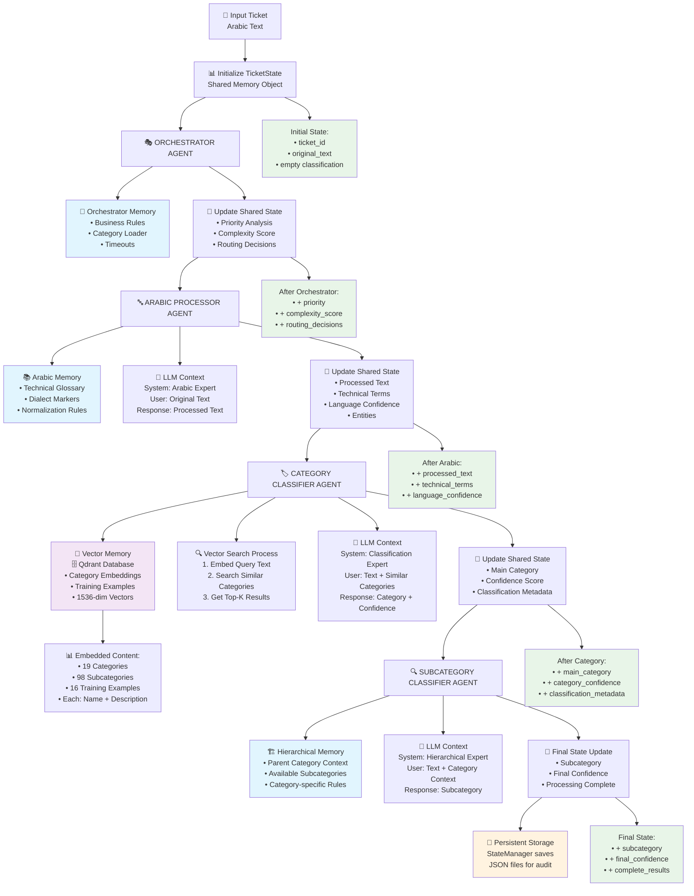

## 🧠 MEMORY FLOW LEGEND

- 🟦 **Individual Agent Memory** (Private to each agent)
- 🟪 **Vector Semantic Memory** (Shared, persistent)  
- 🟢 **Shared State Memory** (Flows through all agents)
- 🟠 **Persistent Memory** (Saved to disk)

## 🔄 CONTEXT SHARING PATTERNS

### Pattern 1: Sequential State Modification
```
TicketState → Agent1.process(state) → Agent2.process(state) → Agent3.process(state) → Final
```

### Pattern 2: Hierarchical Context Inheritance  
```
Category Agent Result → Provides Context → Subcategory Agent Input
```

### Pattern 3: Vector Similarity Context
```
Query Text → Embedding → Vector Search → Similar Categories → LLM Context
```

## 📊 MEMORY CONTENT SUMMARY

| Memory Type | Content | Size | Persistence |
|-------------|---------|------|-------------|
| Shared State | Complete ticket info | ~10KB | Temporary |
| Agent Memory | Configs & caches | ~5MB each | Agent lifetime |
| Vector Memory | Category embeddings | ~100MB | Permanent |
| LLM Context | Conversation history | ~1KB/call | Per API call |
| Persistent | State snapshots | ~1KB/ticket | Permanent |
