```mermaid
graph TD
    A[🎯 Input Ticket<br/>Arabic Text] --> B[📊 Initialize TicketState<br/>Shared Memory Object]
    
    B --> C[🎭 ORCHESTRATOR AGENT]
    C --> D[📝 Orchestrator Memory<br/>• Business Rules<br/>• Category Loader<br/>• Timeouts]
    C --> E[🔄 Update Shared State<br/>• Priority Analysis<br/>• Complexity Score<br/>• Routing Decisions]
    
    E --> F[🔤 ARABIC PROCESSOR AGENT]
    F --> G[📚 Arabic Memory<br/>• Technical Glossary<br/>• Dialect Markers<br/>• Normalization Rules]
    F --> H[🤖 LLM Context<br/>System: Arabic Expert<br/>User: Original Text<br/>Response: Processed Text]
    F --> I[🔄 Update Shared State<br/>• Processed Text<br/>• Technical Terms<br/>• Language Confidence<br/>• Entities]
    
    I --> J[🏷️ CATEGORY CLASSIFIER AGENT]
    J --> K[🧠 Vector Memory<br/>🗄️ Qdrant Database<br/>• Category Embeddings<br/>• Training Examples<br/>• 1536-dim Vectors]
    J --> L[🔍 Vector Search Process<br/>1. Embed Query Text<br/>2. Search Similar Categories<br/>3. Get Top-K Results]
    J --> M[🤖 LLM Context<br/>System: Classification Expert<br/>User: Text + Similar Categories<br/>Response: Category + Confidence]
    J --> N[🔄 Update Shared State<br/>• Main Category<br/>• Confidence Score<br/>• Classification Metadata]
    
    N --> O[🔍 SUBCATEGORY CLASSIFIER AGENT]
    O --> P[🏗️ Hierarchical Memory<br/>• Parent Category Context<br/>• Available Subcategories<br/>• Category-specific Rules]
    O --> Q[🤖 LLM Context<br/>System: Hierarchical Expert<br/>User: Text + Category Context<br/>Response: Subcategory]
    O --> R[🔄 Final State Update<br/>• Subcategory<br/>• Final Confidence<br/>• Processing Complete]
    
    R --> S[💾 Persistent Storage<br/>StateManager saves<br/>JSON files for audit]
    
    %% Vector Database Details
    K --> K1[📊 Embedded Content:<br/>• 19 Categories<br/>• 98 Subcategories<br/>• 16 Training Examples<br/>• Each: Name + Description]
    
    %% Shared State Evolution
    B --> B1[Initial State:<br/>• ticket_id<br/>• original_text<br/>• empty classification]
    E --> E1[After Orchestrator:<br/>• + priority<br/>• + complexity_score<br/>• + routing_decisions]
    I --> I1[After Arabic:<br/>• + processed_text<br/>• + technical_terms<br/>• + language_confidence]
    N --> N1[After Category:<br/>• + main_category<br/>• + category_confidence<br/>• + classification_metadata]
    R --> R1[Final State:<br/>• + subcategory<br/>• + final_confidence<br/>• + complete_results]
    
    %% Memory Types
    style D fill:#e1f5fe
    style G fill:#e1f5fe  
    style K fill:#f3e5f5
    style P fill:#e1f5fe
    style B1 fill:#e8f5e8
    style E1 fill:#e8f5e8
    style I1 fill:#e8f5e8
    style N1 fill:#e8f5e8
    style R1 fill:#e8f5e8
    style S fill:#fff3e0
```

## 🧠 MEMORY FLOW LEGEND

- 🟦 **Individual Agent Memory** (Private to each agent)
- 🟪 **Vector Semantic Memory** (Shared, persistent)  
- 🟢 **Shared State Memory** (Flows through all agents)
- 🟠 **Persistent Memory** (Saved to disk)

## 🔄 CONTEXT SHARING PATTERNS

### Pattern 1: Sequential State Modification
```
TicketState → Agent1.process(state) → Agent2.process(state) → Agent3.process(state) → Final
```

### Pattern 2: Hierarchical Context Inheritance  
```
Category Agent Result → Provides Context → Subcategory Agent Input
```

### Pattern 3: Vector Similarity Context
```
Query Text → Embedding → Vector Search → Similar Categories → LLM Context
```

## 📊 MEMORY CONTENT SUMMARY

| Memory Type | Content | Size | Persistence |
|-------------|---------|------|-------------|
| Shared State | Complete ticket info | ~10KB | Temporary |
| Agent Memory | Configs & caches | ~5MB each | Agent lifetime |
| Vector Memory | Category embeddings | ~100MB | Permanent |
| LLM Context | Conversation history | ~1KB/call | Per API call |
| Persistent | State snapshots | ~1KB/ticket | Permanent |
